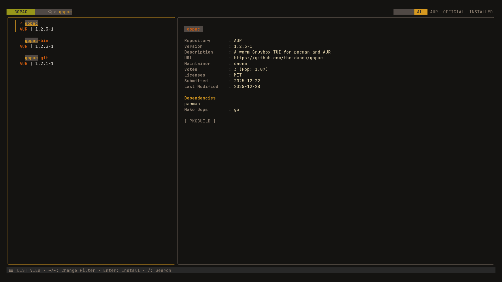

# gopac

A warm, beautiful TUI for Arch Linux package management, written in Go.
**gopac** allows you to search, view, and install packages from both the official Arch repositories and the AUR simultaneously.



## Features

* **Unified Search**: Search Official repos and AUR at the same time.
* **Smart Sorting**: Exact matches and installed packages appear first.
* **Beautiful UI**: Built with [Bubble Tea](https://github.com/charmbracelet/bubbletea) using a cozy Gruvbox theme.
* **Detailed Views**: View maintainer info, votes, versions, and more.
* **Fast**: Written in Go for speed.

## Installation

### From AUR
```bash
yay -S gopac-git
```

**or**

```bash
paru -S gopac-git
```

### Manual Build

```bash
git clone https://github.com/the-daonm/gopac.git
cd gopac
go build
sudo mv gopac /usr/bin/
```

## Usage

Run the app:
```bash
gopac
```

## Configuration

**gopac** automatically detects your AUR helper. It checks for the following tools in this order:
1. `paru`
2. `yay`
3. `pikaur`
4. `aura`
5. `trizen`

You can also manually specify an AUR helper using the `--helper` flag or the `AUR_HELPER` environment variable:

```bash
gopac --helper yay
# or
export AUR_HELPER=yay
gopac
```

### Shell Completions

#### Fish
Copy the completion file to your fish completions directory:
```bash
cp completions/gopac.fish ~/.config/fish/completions/
```

## Keybindings

| Key    | Action                            |
| ------ | --------------------------------- |
| Tab    | Toggle Search Bar focus           |
| Enter  | Install / Remove selected package |
| Ctrl+l | Next Tab (All, AUR, Official, Installed) |
| Ctrl+h | Previous Tab                      |
| q      | Quit                              |
| Ctrl+c | Force Quit                        |

## License

MIT
