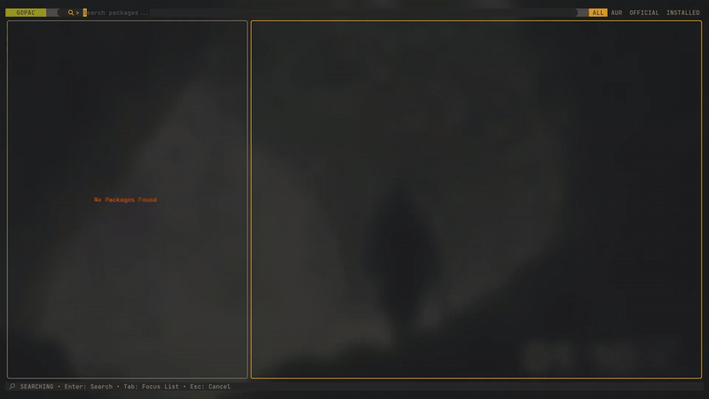
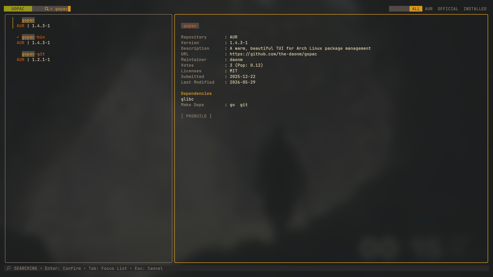

<p align="center">
  
</p>

<p align="center">
  <a href="https://aur.archlinux.org/packages/gopac/"></a>
  <a href="https://aur.archlinux.org/packages/gopac-bin/"></a>
  <a href="LICENCE"></a>
</p>

<h1 align="center">gopac</h1>
<p align="center"><strong>A warm, beautiful Terminal User Interface (TUI) for Arch Linux package management, written in Go.</strong></p>

<p align="center">
  
</p>

---

## Features

- **Unified Search**: Search through Official Arch repositories and the AUR simultaneously.
- **Smart Sorting**: Exact matches and already installed packages bubbled to the top.
- **Modern Aesthetics**: Cozy layouts with full theme customization (Gruvbox, OneDark, Dracula, Nord, Catppuccin).
- **Detailed Package Info**: View maintainer, votes, version histories, and raw **PKGBUILD** files directly in the interface.
- **Bulk & Safe Operations**: Queue multiple package installations or removals. Review detailed package plans and safety warnings before execution.
- **Installed Packages at a Glance**: With an empty search, browse everything installed on your system.
- **Updates Tab**: See pending repo and AUR upgrades (`old → new`) before running a full system upgrade.
- **Orphans Tab**: Find dependencies nothing needs anymore and remove them all with `a` then `I`.
- **AUR Health**: Out-of-date and unmaintained AUR packages are flagged in the list and details.
- **Search History**: Recent searches are remembered across sessions (`↑`/`↓` in the search bar).
- **Speed & Portability**: Built with Go and Charmbracelet's `bubbletea` for high performance and low dependencies.

---

## Screenshots

<details>
  <summary>Click to expand screenshots</summary>
  <br>
  <p align="center">
    
  </p>
</details>

---

## Keybindings

`gopac` features intuitive keyboard navigation. Press `?` inside the app to toggle the help overlay.

| Key | Action | Context |
| :--- | :--- | :--- |
| `q` | Quit application | Global |
| `?` | Toggle help overlay | Global |
| `/` | Focus search bar | Global |
| `tab` | Cycle focus (Search ➔ List ➔ Details) | Global |
| `shift+tab` | Cycle focus backwards | Global |
| `U` | Perform system upgrade (`pacman -Syu` / helper equivalent) | Global |
| `I` | Process queued operations (Install/Remove modal) | Global |
| `C` | Clear marked package queue | Global |
| `r` | Refresh package data (installed, updates, search) | Global |
| `p` | Toggle AUR PKGBUILD view | Global (for AUR packages) |
| `j` / `↓` | Select next package | List Pane |
| `k` / `↑` | Select previous package | List Pane |
| `h` / `←` | Switch to previous tab | List Pane (ALL ➔ AUR ➔ OFFICIAL ➔ INSTALLED ➔ UPDATES ➔ ORPHANS) |
| `l` / `→` | Switch to next tab | List Pane |
| `space` | Mark package for installation/removal | List Pane |
| `a` | Mark/unmark all visible packages | List Pane |
| `enter` | View/confirm operations for selected package (upgrade all in UPDATES) | List Pane |
| `j` / `↓` | Scroll details down line-by-line | Details Pane |
| `k` / `↑` | Scroll details up line-by-line | Details Pane |
| `ctrl+d` | Page down details (10 lines) | Details Pane |
| `ctrl+u` | Page up details (10 lines) | Details Pane |
| `esc` | Back to package list focus | Details / Search Pane |

---

## Configuration

`gopac` checks for user configurations in `~/.config/gopac/config.yaml`.

```yaml
# ~/.config/gopac/config.yaml

# Set your preferred AUR helper (e.g. paru, yay, pikaur, aura, trizen)
# If empty, gopac will auto-detect helpers in order of popularity
aur_helper: yay

# Choose your theme style
# Supported options: gruvbox, onedark, dracula, nord, catppuccin
theme: gruvbox
```

### Supported Themes

| Theme | Config Value | Description |
| :--- | :--- | :--- |
| **Gruvbox** (Default) | `gruvbox` | Retro-cozy pastel style |
| **Dracula** | `dracula` | High-contrast dark theme |
| **OneDark** | `onedark` | Warm, balanced dark colorway |
| **Nord** | `nord` | Clean, cool arctic palette |
| **Catppuccin** | `catppuccin` | Soft, warm pastel design |

### Auto-Detection Order
When `aur_helper` is not specified, `gopac` will automatically search your `$PATH` and use the first available helper:
1. `paru`
2. `yay`
3. `pikaur`
4. `aura`
5. `trizen`
6. `pacman` (fallback for official repositories only)

You can also specify the environment variable `AUR_HELPER` to override auto-detection without writing a config file:
```bash
export AUR_HELPER=paru
```

---

## Installation

### AUR (Arch User Repository)

You can install `gopac` directly using your favorite AUR helper:

```bash
# Compile and install from source
yay -S gopac

# Install pre-built binary
yay -S gopac-bin
```

### Manual Compilation

Alternatively, you can build from source:

```bash
# Clone the repository
git clone https://github.com/the-daonm/gopac.git
cd gopac

# Build binary
make build

# Move binary to target path
sudo mv gopac /usr/bin/
```

### Shell Autocompletions

To install fish shell completions:

```bash
mkdir -p ~/.config/fish/completions
cp completions/gopac.fish ~/.config/fish/completions/
```

---

## CLI Arguments

`gopac` supports several startup flags to temporarily override configurations:

```bash
Usage: gopac [flags]

Flags:
  -H, --helper     Specify AUR helper to use (e.g. paru, yay)
  -t, --theme      Specify UI theme (gruvbox, onedark, dracula, nord, catppuccin)
  -v, --version    Show version information
```

### Examples

```bash
# Start gopac with the Dracula theme
gopac -t dracula

# Use paru as the AUR helper
gopac --helper paru
```

---

## License

This project is licensed under the **MIT License** - see the [LICENCE](LICENCE) file for details.


